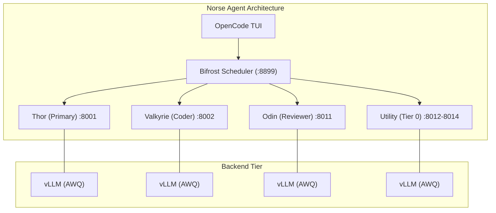

# PROGRESS.md — Phase 6: Full vLLM AWQ Migration

**Status**: COMPLETED ✅  
**Date**: 2026-02-10  
**Branch**: `main`

---

## What Changed (vLLM AWQ Migration)

We have successfully migrated the entire Norse Agent stack to **vLLM using AWQ 4-bit quantization**. This move solves the memory constraints while keeping all agents on the high-performance vLLM backend.

### Completed ✅

- [x] **vLLM AWQ Implementation** — Enabled INT4 AWQ models on strix-halo (gfx1151).
- [x] **Environment Sync** — Updated `.env` and `.env.example` with AWQ model IDs and ports.
- [x] **Docker Compose Rewrite** — Unified `compose/hybrid.yml` to run Tier 0-3 agents on vLLM.
- [x] **OpenCode Configuration** — Re-aligned `opencode/opencode.jsonc` with the new 6-agent vLLM port mapping.
- [x] **Scripting** — Updated `scripts/up` and `scripts/health` for AWQ-only operation.
- [x] **Documentation** — Documented the build process for gfx1151 compatibility in `DECISIONS.md`.
- [x] **README.md** — Reflected the current architecture status.

---

## Current Architecture: Phase 6 (Full vLLM AWQ)

## Memory Budget (128 GB Shared UMA)

| Component | Weight | KV Cache (32K) | Total Allocation | Notes |
|-----------|--------|----------------|------------------|-------|
| Thor (14B AWQ) | ~8 GB | ~17 GB | 25 GB | Always running |
| Valkyrie (30B MoE AWQ) | ~17 GB | ~33 GB | 50 GB | Active during coding |
| Odin (70B AWQ) | ~40 GB | ~24 GB | 64 GB | On-demand review |
| Utility (3B-14B AWQ) | 2-8 GB | 4-16 GB | 6-24 GB | On-demand quick tasks |

**Strategy**: Odin and Valkyrie are managed as conflicting tiers to ensure we never oversubscribe the 120 GB usable RAM.

## Hardware Support (gfx1151 / RDNA 3.5)

AWQ support confirmed using a custom vLLM fork/patch that avoids proprietary Triton/FlashAttention paths where incompatible.

---

## Next Steps

- [ ] Performance profiling of the 70B AWQ on UMA.
- [ ] Tuning `BIFROST_ODIN_TTL` for optimal swap behavior.
- [ ] Adding more Knowledge Curators (Frigga) to the utility tier.
